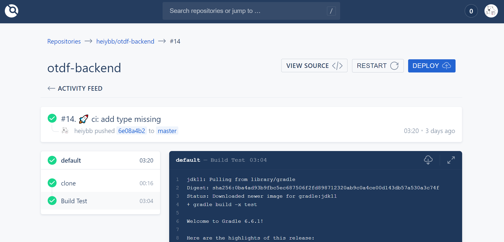
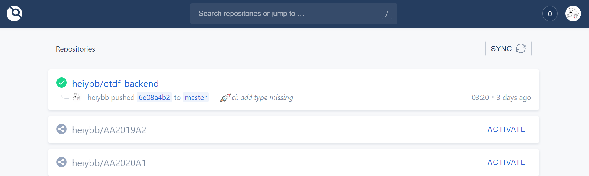

## About

Drone is a modern Continuous Integration and Continuous Delivery platform that empowers busy teams to automate their build, test and release workflows. 

This template aims for Github platform,  refer https://docs.drone.io/server/provider/github/ for more details.

Before start it, you need to create an OAuth application through the official doc above.

## Prerequirements 

In general, you need the following build dependencies:

- docker
- docker-compose
- git

## Installation 

Modify the values in the ```.env``` with your own preference.

```shell
git clone https://github.com/heiybb/drone-docker.git
cd drone-docker && docker-compose up -d
```

Use ```docker ps``` to check if the container is running properly.  

Enjoy it.

## Screenshots
Home Page


Build Log



